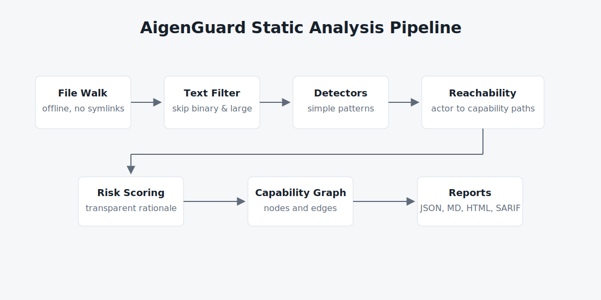

# AigenGuard Architecture

AigenGuard is a static bill-of-materials scanner for AI agent repositories. The long-term goal is to describe the parts of an agent system that matter for security review: what AI services it uses, what code or frameworks connect to those services, what external tools are available, and which risks are reachable from those connections.

AgentBOM has been renamed to AigenGuard. The `agentbom` CLI remains a
compatibility alias, and `agentbom.toml` remains a compatibility fallback. New
projects should use `aigenguard` and `aigenguard.toml`.

The project should remain useful in local development, CI, and offline review environments. It favors simple static evidence over opaque scoring or generated summaries.



```mermaid
flowchart LR
  files[Repository files] --> filter[Text and size filter]
  filter --> detectors[Pattern detectors]
  detectors --> reachability[Reachability inference]
  reachability --> graph[Capability graph]
  reachability --> risk[Risk and policy scoring]
  graph --> reports[Reports]
  risk --> reports[JSON, Markdown, HTML, Mermaid, SARIF]
```

## Core Concepts

Providers are AI service vendors or runtime providers, such as OpenAI, Anthropic, or Google. A provider identifies who supplies a model or API surface, but it does not identify a specific model version.

Models are concrete model identifiers found in code or configuration, such as `gpt-4o` or `claude-3-opus`. Models are the AI decision points that may be able to invoke frameworks or tools.

Frameworks are agent or orchestration libraries, such as LangChain, CrewAI, AutoGen, LlamaIndex, or Semantic Kernel. Frameworks often mediate how models call tools, load prompts, and access external systems.

Capabilities are raw static findings that indicate a repository can perform an action, such as shell execution, network access, database access, code execution, or cloud access. Capabilities are intentionally broad in early versions.

Reachable capabilities connect an actor to an action and a risk. An actor can be a model, framework, or tool configuration. A reachable capability answers a narrower question: which detected model, framework, or tool appears connected to which capability, in which file, with what confidence.

Risks are scanner-level assessments derived from findings. They summarize likely security concerns, such as execution capabilities or prompt files without a policy file. Risks are not vulnerability claims; they are review signals.

## Scanner Pipeline

1. File discovery

   The scanner walks the target directory without following symlinks. It skips known generated or dependency directories, including `.git`, virtual environments, build output, caches, and `node_modules`.

2. Text filtering

   Files larger than 1 MB are skipped. Binary-looking files are skipped. The scanner only reads files that are likely text, based on known suffixes, known filenames, or a small null-byte sample.

3. Detectors

   Detectors run simple pattern matching over text. They identify providers, models, frameworks, MCP config files, prompt files, capabilities, and secret references. Secret detection records names only and must not store secret values.

4. Inference

   Inference derives higher-level relationships from detector output. For reachability, AigenGuard connects model, framework, or tool findings to capability findings using deterministic rules and source-file locality.

5. Reporting

   The CLI emits JSON for tooling and Markdown for human review. Existing fields should remain stable so downstream consumers can rely on the report shape.

## Design Constraints

AigenGuard is offline-first. The scanner must work without network access so it can run in restricted CI, private repositories, and incident-review environments.

AigenGuard is deterministic. The same input repository should produce the same output, aside from explicit version or path changes. This makes results auditable and diff-friendly.

AigenGuard is non-executing. It does not execute scanned code, import scanned modules, follow dynamic plugin loading, or evaluate project configuration. Static evidence is less complete, but it avoids triggering malicious or unsafe code.

AigenGuard is dependency-light. Runtime dependencies increase supply-chain risk and make offline operation harder. New dependencies should be avoided unless they solve a clear scanner problem that cannot be handled simply.

## AI Agent Attack Surface Analysis

AI agents combine model reasoning with software capabilities. The important security question is not only whether a risky API exists in a repository, but whether an agent-controlled path can reach it.

AigenGuard models this attack surface in layers:

- AI layer: providers and models that generate decisions or tool calls.
- Orchestration layer: frameworks that route prompts, memory, tools, and callbacks.
- Tool layer: MCP servers, shell commands, cloud SDKs, network clients, databases, and code execution surfaces.
- Control layer: prompt files, policy files, and configuration that constrain or expose behavior.
- Risk layer: inferred review signals based on detected capabilities and missing controls.

In early versions, this analysis is rule-based and conservative. It should prefer explainable findings with source files and confidence values over broad claims.

## Differentiation From Traditional SAST

Traditional SAST usually starts with language-specific vulnerability patterns.
AigenGuard starts with the AI agent inventory and asks which agent actors appear
connected to sensitive capabilities.

The distinction matters because an AI agent review often needs evidence such as:

- which model provider and model identifiers are present
- which framework may route tool calls
- whether prompt or MCP configuration surfaces exist
- whether a capability is merely present or appears reachable from an AI actor
- whether repository policy documents the expected control

AigenGuard should stay complementary to SAST rather than becoming a general
language vulnerability scanner.

## Roadmap Ideas

Capability graphing: represent providers, models, frameworks, tools, capabilities, source files, and risks as an explicit graph that can be queried or visualized.

Reachability analysis: improve actor-to-capability inference using simple static structure, configuration references, tool registration patterns, and MCP metadata while preserving deterministic output.

Trust scoring: derive transparent trust signals from policies, pinned dependencies, capability exposure, secret handling, and reviewed configuration. Scores should explain their inputs.

MCP analysis: parse MCP configuration more deeply, classify server transports, identify command-backed servers, and connect MCP tools to reachable capabilities.

Policy validation: compare detected capabilities against repository policy files or explicit allowlists, then report missing, stale, or violated controls.
