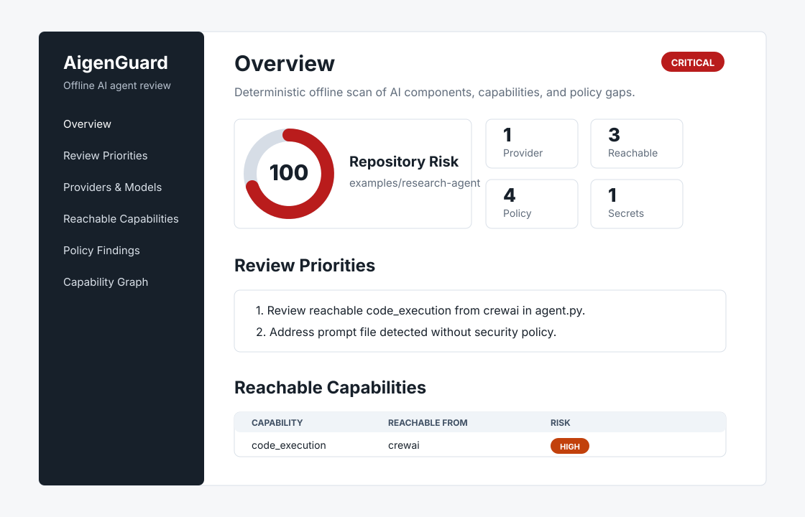

# AigenGuard

Local-first pre-commit policy guard for AI-agent repositories.


[](https://github.com/vlcak27/aigenguard/actions/workflows/precision-corpus.yml)


AigenGuard helps review AI-agent repositories before risky changes land in git.
It installs a repo-local pre-commit guard and produces deterministic static
review signals for code, prompts, MCP config, policy gaps, and AI/API credential
context.

AI-agent repos often spread important behavior across prompt files, tool
permissions, MCP servers, and credential references. AigenGuard makes those
changes visible in the normal commit workflow.

Version [0.9.0 is published on PyPI](https://pypi.org/project/aigenguard/0.9.0/).
New here? Follow the [install → finding → fix walkthrough](docs/demo-workflow.md#configuration-review-in-five-minutes)
using the published package and a disposable demo. It is intended for developers
reviewing supported MCP configuration in Git; it does not verify runtime access.

## Primary Workflow

```bash
pip install aigenguard==0.9.0
cd my-agent-repo
aigenguard activate
# Inspect the generated/reused policy before staging it.
git add aigenguard.toml
git commit
```

`aigenguard activate` creates or reuses `aigenguard.toml` and installs the local
pre-commit guard. If activation reuses `agentbom.toml`, stage that file instead.
After that, commits run the static guard locally.

## Example Blocked Change

```text
AigenGuard blocked this commit

CRITICAL Possible OpenAI API key value
.env:1
Why: likely credential value found in a committed file.
Fix: remove the key, rotate it, and keep secrets in environment variables or a secret manager.
Secret value redacted.
```

The local guard can allow, confirm, or block commits based on configured policy.
Static findings are review signals, not exploit proof.

## Local-First Trust Model

- Static scans run locally and work offline.
- Static scans do not execute scanned code or import scanned modules.
- Static scans do not execute MCP servers or contact networks.
- Secret values are redacted and must not be printed or stored.

## Review configuration changes in 0.9.0

Review what an MCP or policy change newly permits:

```bash
aigenguard review --base HEAD --staged --fail-on high
```

The offline demo changing a configured filesystem root from `/workspace/project`
to `/` produces:

```text
AigenGuard review: complete; 1 change/review finding(s).
HIGH mcp.filesystem_scope [expanded] .mcp.json /mcpServers/files/args
```

JSON/Markdown reports explain safe before/after values, policy weakening, and
candidate violations of the original policy. This is configured access, not proof
of runtime reachability. Existing hooks are unchanged. See
[coverage, exit codes, offline demo, and the maintained PR workflow](docs/config-review.md).
Try the [offline demo and fix](docs/demo-workflow.md#configuration-review-in-five-minutes)
(designed for five minutes; not measured with users). For risk versus incomplete input and the
independent labelled corpus, see [review evaluation and pilot guide](docs/review-evaluation.md).

## AgentBOM Compatibility

AgentBOM is now AigenGuard. The `agentbom` CLI and `agentbom.toml` remain supported during migration. New projects should use `aigenguard` and `aigenguard.toml`.

Policy discovery uses this order:

1. An explicit `--policy` path.
2. `aigenguard.toml` when present.
3. `agentbom.toml` as a compatibility fallback.

Compatibility remains for existing automation:

- `agentbom` CLI alias
- `agentbom` Python import aliases
- `agentbom.toml` fallback
- `agentbom.*` report filenames
- `.agentbom/` runtime artifacts
- `AGENTBOM_SKIP_HOOK` hook bypass alias

## Recommended Workflow

`aigenguard activate` creates or reuses `aigenguard.toml` and installs a
repo-local pre-commit guard. Existing `agentbom.toml` files are reused as a
compatibility fallback. The default mode is `confirm`: passing commits print
`AigenGuard OK`, and the guard asks before committing when policy violations are
found. Activation only affects this local clone and does not overwrite an
existing policy unless `--force` is passed.

```bash
aigenguard status
aigenguard scan . --policy aigenguard.toml --html --open
```

Activation presets:

- `safe`: default, good for normal use.
- `audit`: observe without blocking.
- `strict`: stronger policy for sensitive repos.

`aigenguard activate --strict` remains available as an alias for
`aigenguard activate --preset strict`.

## Policy Review

Policy review is advisory by default:

```bash
aigenguard scan . --policy aigenguard.toml --pretty
```

Make policy violations fail a scan only when you opt in:

```bash
aigenguard scan . --policy aigenguard.toml --enforce-policy
```

The HTML report includes a Policy Workbench for generating and refining
`aigenguard.toml` from detected providers, models, frameworks, reachable
capabilities, MCP servers, secret references, and policy gaps.

See [policy docs](docs/policy.md) for policy format, rollout, local guard
modes, and bypass behavior.

## Local Guard

Install a repo-local pre-commit guard:

```bash
aigenguard activate
```

Modes:

- `advisory` allows commits and warns on policy violations.
- `confirm` asks before committing when violations exist.
- `enforce` blocks commits when violations exist.

The hook scans the **complete staged snapshot**, using the staged policy, so
partial staging and staged deletions match the commit. Stage the policy with
`git add aigenguard.toml` (or your selected policy path) before committing.
Manual `aigenguard scan .` still inspects the working directory.

The hook uses Git's effective hook path, normally `.git/hooks/pre-commit`.
Repository-contained `core.hooksPath` directories are supported; external paths
and symlink hook paths are rejected. Reinstall an existing hook with
`aigenguard install-hook` to enable staged behavior while preserving the installed
mode, policy, and executable. Upgrading the Python package alone does not update
existing hooks. Run `aigenguard status` before and after reinstalling; see the
[upgrade procedure](docs/policy.md#upgrading-an-existing-installation).
Disable it with:

```bash
aigenguard deactivate
```

Troubleshooting prompt or PATH issues: [troubleshooting](docs/troubleshooting.md).

## Optional runtime evidence

`aigenguard run` intentionally executes a configured or autodetected command.
This experimental, Python-focused RunBOM workflow is separate from static scan,
review and pre-commit. It is neither a sandbox nor runtime policy enforcement.
See [RunBOM](docs/runbom.md) for instrumentation and `.agentbom/` artifacts.

## What It Finds

| Area | Examples |
| --- | --- |
| Providers and models | OpenAI, Anthropic, Gemini, Ollama, OpenRouter, GPT/o-series, Claude, Gemini, Llama, Mistral, Qwen, Grok, Cohere, Perplexity |
| Frameworks | LangChain, LangGraph, LlamaIndex, CrewAI, AutoGen/AG2, Semantic Kernel, Pydantic AI, OpenAI Agents SDK, Mastra, Vercel AI SDK, LiteLLM |
| Prompts | `AGENTS.md`, `CLAUDE.md`, `prompts/*.md`, prompt YAML |
| MCP | `mcp.json`, `.mcp.json`, `claude_desktop_config.json`, Cursor/Claude MCP config paths |
| Capabilities | shell, code execution, network, database, cloud, MCP tool invocation |
| Secret references | credential names such as `OPENAI_API_KEY`, never values |
| Secret leak findings | likely AI/API credential values, always redacted |
| Policy gaps | prompt files, MCP config, shell/cloud access without policy documentation |

Findings include source paths, confidence, reviewer-facing rationale, and
mitigation signals where static evidence is available.

## Reports



Generate review artifacts:

```bash
aigenguard scan . --output-dir aigenguard-report --html --mermaid --sarif --pretty
```

Diff-aware scans compare the current report with a baseline JSON report:

```bash
aigenguard scan . --baseline agentbom-baseline.json --fail-on-new high --sarif --html --pretty
```

`--fail-on-new` accepts `low`, `medium`, `high`, or `critical`.

See the [report guide](docs/report-guide.md) for field definitions and reviewer
workflow.

Report filenames remain `agentbom.json`, `agentbom.md`, `agentbom.html`,
`agentbom.mmd`, `agentbom.sarif`, and `agentbom.cdx.json` for compatibility
with existing automation. RunBOM artifacts also remain under `.agentbom/`.

## GitHub Action

For MCP/policy deltas use the [maintained PR review workflow](examples/config-review/github-actions.yml).
For full working-tree inventory use the existing scan Action:

```yaml
name: AigenGuard

on:
  pull_request:
  push:
    branches: [main]

permissions:
  contents: read

jobs:
  scan:
    runs-on: ubuntu-latest
    steps:
      - uses: actions/checkout@v4

      - name: Run AigenGuard
        uses: vlcak27/aigenguard@v0.9.0
        with:
          path: .
          fail-on: none
          sarif-upload: false
          html: true
          output-dir: aigenguard-report

      - name: Upload AigenGuard reports
        uses: actions/upload-artifact@v4
        with:
          name: aigenguard-report
          path: aigenguard-report/
```

Enable SARIF upload only when you want GitHub code scanning alerts:

```yaml
permissions:
  contents: read
  security-events: write
```

More details: [GitHub Action docs](docs/github-action.md).

New workflows should use `vlcak27/aigenguard@...`. Existing workflows that use
`vlcak27/agentbom@...` need the old action repository and tag to remain
available; do not rely on repository redirects alone for action compatibility.

## Security Model

Static scan and local guard:

- `aigenguard scan` and the local guard are static-only
- does not execute scanned code
- does not import scanned modules
- does not execute MCP servers
- does not contact networks during scanning
- skips files larger than 1 MB
- skips binary-looking files
- does not follow symlink loops
- records secret references by name and likely credential leaks with redacted
  metadata only, never secret values
- works offline and emits deterministic output for the same input repository

RunBOM:

- optional
- intentionally executes the configured or autodetected command
- records best-effort Python runtime evidence
- prints a human-readable terminal summary
- writes JSON artifacts under `.agentbom/`
- never records secret values
- not a sandbox
- no policy enforcement yet

## Limitations

- Findings are review signals, not exploit verification.
- Reachability is inferred from nearby static evidence, not runtime traces.
- False positives and missed detections are possible.
- AigenGuard is AI-agent focused. Use SAST for language-specific vulnerability
  patterns and SBOM tools for package inventory.
- AI/API credential leak checks are focused review signals and are not a
  replacement for full secret scanners such as Gitleaks or TruffleHog.
- Dependency parsing is deterministic and limited, not a full lockfile solver.
- AigenGuard is not an SBOM, SPDX, or CycloneDX replacement.

## Development

```bash
pip install -e ".[dev]"
ruff check .
pytest
```

Or run the project check:

```bash
make check
```

Useful docs:

- [CHANGELOG.md](CHANGELOG.md)
- [CONTRIBUTING.md](CONTRIBUTING.md)
- [SECURITY.md](SECURITY.md)
- [ARCHITECTURE.md](ARCHITECTURE.md)
- [Precision](docs/precision.md)
- [Threat model](docs/threat-model.md)
- [Comparison](docs/comparison.md)
- [Agent risk taxonomy](docs/agent-risk-taxonomy.md)
- [Troubleshooting](docs/troubleshooting.md)
- [RunBOM](docs/runbom.md)
