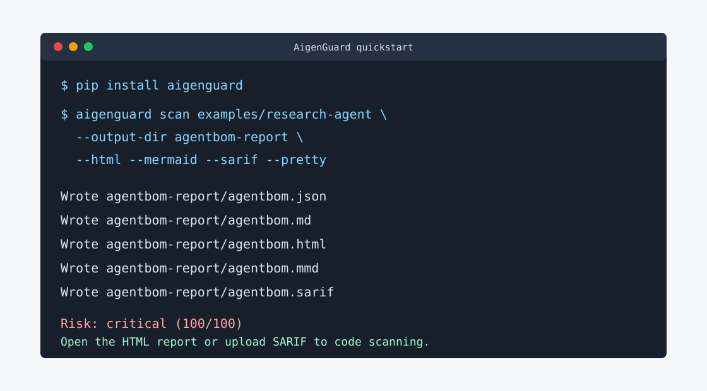

# Demo Workflow

Use this workflow when recording a demo, writing a release post, or validating
the first-run experience.

## 1. Install

```bash
pip install aigenguard
```

## 2. Scan a controlled agent

```bash
aigenguard scan examples/customer-support-agent \
  --output-dir aigenguard-report/support \
  --html \
  --mermaid \
  --sarif \
  --pretty
```

Expected use: show that AigenGuard identifies AI components and capabilities while
recognizing documented controls.

## 3. Scan a riskier agent

```bash
aigenguard scan examples/research-agent \
  --output-dir aigenguard-report/research \
  --html \
  --mermaid \
  --sarif \
  --pretty
```

Expected use: show review priorities, reachable capabilities, policy findings,
and SARIF output.

## 4. Open the reports

```bash
open aigenguard-report/research/agentbom.html
cat aigenguard-report/research/agentbom.mmd
```

The HTML report is self-contained and works offline. The Mermaid report can be
pasted into GitHub Markdown or rendered by tools that support Mermaid.




## Configuration review in five minutes

Five minutes is a design goal, not a measured user-study result. Use the existing
offline demo from an approved release checkout; it creates a disposable repository
and never starts MCP servers. With Python 3.11+ and Git installed, build and install
the wheel in a fresh environment, then run the demo with that environment:

```bash
python -m pip install build
python -m build
python -m venv /tmp/aigenguard-demo-env
/tmp/aigenguard-demo-env/bin/python -m pip install --no-index --no-deps \
  "$PWD/dist/aigenguard-0.9.0-py3-none-any.whl"
/tmp/aigenguard-demo-env/bin/python scripts/demo_config_review.py \
  --output-dir /tmp/aigenguard-review-demo
```

Choose fresh paths. On Windows use the environment's `Scripts/python.exe`.
After verified publication, the install step can use `aigenguard==0.9.0` from PyPI.
The demo runs the installed CLI outside the source checkout. Actual 0.9.0 results:

| Scenario | Result | Exit |
|---|---|---|
| Formatting only | complete; no security change | 0 |
| `/workspace/project` → `/` | high filesystem scope expansion | 1 |
| Expansion + weakened model policy | expansion, weakening, original-policy violation | 1 |
| `/` → `/workspace/project` | low narrowing; threshold not exceeded | 0 |

The useful finding is configured startup scope expansion, not proof that a
running server accessed those files. The fix is to narrow the configured root
back to the intended project directory. `results.json` records exact local
base/head SHAs; each scenario has complete JSON and readable Markdown reports.

To observe staged versus working-tree behavior, in the demo repository:

```bash
cd /tmp/aigenguard-review-demo/repository
# Edit .mcp.json to use /, then stage it:
git add .mcp.json
# Edit it back to /workspace/project WITHOUT staging the correction.
/tmp/aigenguard-demo-env/bin/aigenguard review --base HEAD --staged --fail-on high
# Still exit 1: the staged expansion is what a commit would contain.
git add .mcp.json
/tmp/aigenguard-demo-env/bin/aigenguard review --base HEAD --staged --fail-on high
# Exit 0 after staging the correction.
```

Manual `scan .` inspects the working tree; installed hooks inspect the complete
index and its staged policy. Missing baseline or malformed JSON produces review
exit 2, even with no threshold. Inspect coverage, agree a policy on the protected
base branch, commit it through normal review, and compare subsequent changes.
Never automatically bless a permissive policy just to turn CI green.
